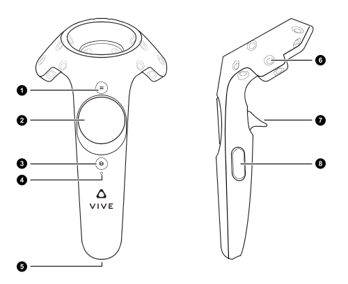

# Teleoperation with VR controller

Tested on Ubuntu 20.04 with an *HTC Vive* VR headset and controller.
The code should be mostly compatible with an *Occulus Rift* too, which, however, only runs on Windows (AFAIK).
For *Occulus* you might have to adapt the button ids in the `vr_input.py`



## Setup
### Install Steam and SteamVR
- In terminal run `$ steam`, it will start downloading an update and create a `.steam` folder in your home directory.
- If you get an error, try deleting the steam folders on your home directory with `rm -rf .local/share/Steam/` and `rm -rf .steam`.
- In *Steam*, create user account or use existing account.
- Install *SteamVR*.
- Restart *Steam*.
- Connect and turn on *HTC VIVE*.
- Launch *SteamVR* (if not shown, check `[] Tools` box).
- Make sure Headset and controller are correctly detected.
- Go through VR setup procedure (standing is sufficient).
- *Steam* and *SteamVR* have to be running for teleoperation.

### Install Bullet
```
$ git clone https://github.com/bulletphysics/bullet3.git
$ cd bullet3
```
For building Bullet for VR  add `-DUSE_OPENVR=ON` to line 8 of `build_cmake_pybullet_double.sh` and run
```
$ ./build_cmake_pybullet_double.sh

$ pip install numpy  # important to have numpy installed before installing bullet
$ pip install -e .  # effectively this is building bullet a second time, but importing is easier when installing with pip
```
Add alias to your bashrc
```
alias bullet_vr="~/.steam/steam/ubuntu12_32/steam-runtime/run.sh </PATH/TO/BULLET/>bullet3/build_cmake/examples/SharedMemory/App_PhysicsServer_SharedMemory_VR"
```

## Usage
### Preparation
Make sure SteamVR is running and headset and controller are detected by the lighthouses.
Only one VR controller can be turned on at the same time.

In a terminal, start the bulletVR runtime with your previously defined alias:
```
$ bullet_vr
```
Read the robot [guide](robots.md) and adapt the robot config for the scene you want to manipulate.
Especially make sure the workspace limits and the neutral position are correctly set.
If the robot could get stuck moving to the neutral position, use hand guiding or manual control to move it to a suitable configuration.

To start the teleopration with the *Panda* robot, run
```
$ python robot_io/examples/teleop_robot.py config-name=panda_teleop
```
### Teleop instructions
The robot will first move to its neutral position. Next, align the coordinate axes of the VR coordinate system and the robot base coordinate system:
1. Press dead-man switch (button 8) on the *HTC VIVE* VR controller.
2. Move controller in the direction of the positive x-axis of the robot base frame (typically forward from the robot's perspective).
3. Push top middle button with three lines (button 1).

Robot only moves with dead-man-switch pressed. If released, the controller can be moved around freely until the dead man's switch is pressed again.
